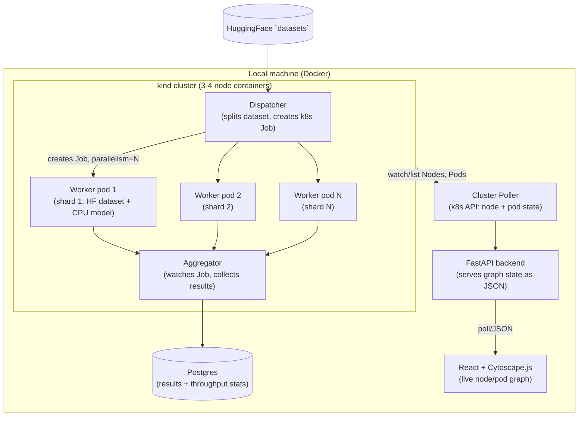

# Spec: Cluster Inference & Compute Radar (Local, CPU-only)

## Goal

Build a small distributed system that (1) shards a real HuggingFace dataset across a local
Kubernetes cluster for parallel CPU inference, and (2) visualizes cluster compute state and job
flow as a live node graph. Entirely runnable on a laptop — no cloud account required.

## Stack

| Layer | Choice | Notes |
|---|---|---|
| Local cluster | `kind` (Kubernetes-in-Docker) | Multi-node cluster as Docker containers. `k3d` is an equally valid alternative if `kind` gives trouble. |
| Container runtime | Docker Desktop / Colima | Whatever already runs `kind`'s node containers. |
| Cluster orchestration | `kubectl` + `kubernetes` Python client | Dispatcher and poller both talk to the k8s API via the Python client, not shell-outs to `kubectl`. |
| Dataset | HuggingFace `datasets` | Start with one CPU-friendly task (see Approach). |
| Inference model | `sentence-transformers/all-MiniLM-L6-v2` (embeddings) or a small `distilbert` zero-shot/classification pipeline | Must run on CPU with no code changes — no `device="cuda"`. |
| Results store | Postgres (as a Docker container, or in-cluster) | Reuses the least-privilege / schema-design patterns from prior work. |
| Radar backend | FastAPI | Serves cluster/job state as JSON; polls the k8s API on an interval. |
| Radar frontend | React + Cytoscape.js (or React Flow) | Deliberately minimal — see Out of Scope. |
| Language | Python 3.11+ (backend/workers), TypeScript/JS (frontend only) | |

Everything above runs on localhost. No AWS/GCP/Azure account, IAM, or billing involved.

## Approach

### Phase 1 — Cluster-aware batch inference

1. Stand up a `kind` cluster (3–4 nodes: containers pretending to be nodes).
2. **Dispatcher**: loads a fixed subset of an HF dataset, splits it into N shards, and creates a
   k8s `Job` with `parallelism: N` — one pod per shard, shard index passed via env var.
3. **Worker**: each pod pulls its shard, runs the CPU model, writes per-example results + timing.
4. **Aggregator**: watches the Job for completion via the k8s API, collects worker outputs, writes
   summary stats (throughput, wall time, per-shard timing) to Postgres.
5. Add `resources.requests`/`limits` per pod. Test under-provisioned scenarios deliberately
   (ask for more pods than the cluster can schedule at once) to observe real scheduling behavior.
6. Scope a least-privilege `ServiceAccount`/`Role` for the dispatcher (create/watch Jobs, read
   Pods only).

### Phase 2 — Compute availability radar

7. **Poller**: polls the k8s API every few seconds for node capacity vs. allocated resources, and
   current pod state (pending/running/succeeded/failed, which node each pod is on).
8. **Backend** (FastAPI): exposes current graph state as JSON — nodes (cluster nodes + utilization
   %), children (pods + their node), edges (the shard → infer → aggregate DAG from Phase 1).
9. **Frontend**: renders that JSON as a graph — node color/intensity for utilization, pods
   appearing and disappearing as Phase 1 jobs run, so the graph reflects real state, not a
   simulation.
10. Demo: trigger a Phase 1 job, watch the radar animate scheduling and utilization live.

## Architecture

## Out of scope (explicitly, for this version)

- **GPU compute.** All models run CPU-only. No CUDA, no GPU node pools, no GPU scheduling
  (`nvidia.com/gpu` resource requests, device plugins, etc.). If this is revisited later, it would
  be a distinct follow-on phase, not part of this spec.
- **Live scheduling against cloud infrastructure.** No cluster autoscaling, no real multi-machine
  clusters (EKS/GKE/AKS), no cost-aware or cloud-provider-aware scheduling decisions. `kind`'s
  "nodes" are containers on one machine — scheduling behavior is real, but capacity is fixed and
  local for the duration of this spec.
- **A full production frontend.** No auth, no multi-user support, no responsive/polished UI,
  no persisted user preferences, no deployment of the frontend anywhere — it's a local dev-server
  visualization tool, not a shipped product. Time goes into making the graph reflect real state
  correctly, not into UI polish.

## Future work — Phase 3: reusable radar package

Once Phase 1 and Phase 2 work end-to-end against this project's own workload, generalize the
radar (poller + backend + frontend) into a standalone installable package (e.g. `pip install
cluster-radar`) that anyone can point at their own Kubernetes cluster/namespace to visualize
their own workload — not just this project's dispatcher. This means:

- A configurable label selector / namespace instead of assumptions tied to this project's Job.
- Dropping the hard dependency on Postgres/throughput-stats schema specific to this demo.
- A CLI entry point (e.g. `cluster-radar watch --namespace foo`) that reads the user's kubeconfig
  and serves the graph without any setup beyond `pip install`.

Explicitly not part of Phase 2 — this is deferred until the radar has proven itself on the
Phase 1 workload first.

## Definition of done (for this spec)

- A `kind` cluster running locally with no manual pod creation — the dispatcher creates
  everything via the k8s API.
- A real HF dataset subset processed end-to-end (dispatch → infer → aggregate → stored results),
  with a reported throughput number at two or more parallelism levels.
- A live graph in the browser that visibly changes (pod nodes appearing/disappearing, utilization
  color shifting) while a Phase 1 job runs — not a static screenshot, an actual live demo.
